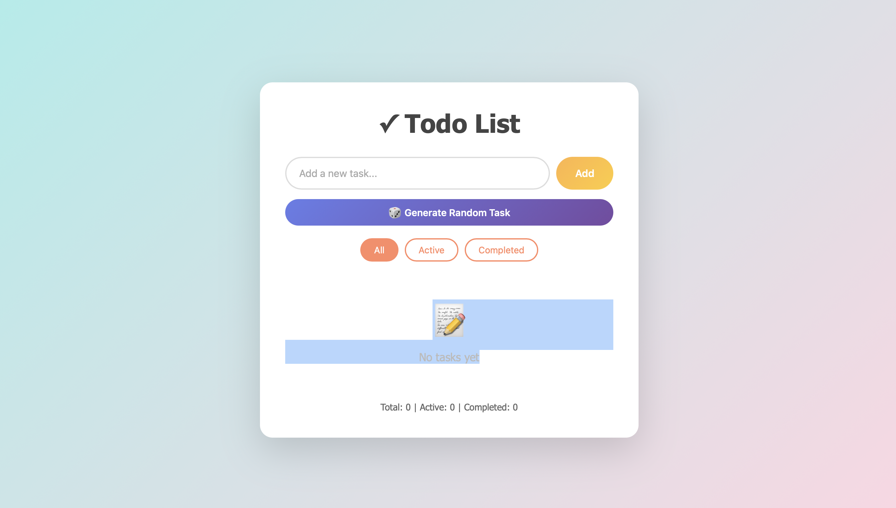
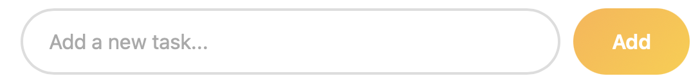
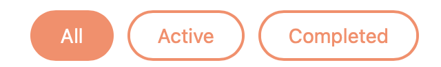
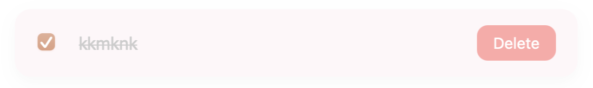

# ✓ Todo List App

A simple and elegant todo list application to manage your daily tasks.

**[🔗 Live Demo](https://ulukbek11.github.io/todolistwebproject/)**



## 📋 About

Todo List App is a minimalist task management application that helps you organize your daily activities. The design was created in Figma and implemented with vanilla JavaScript for optimal performance.

## ✨ Features

- ✅ Add new tasks quickly
- ✏️ Mark tasks as completed
- 🗑️ Delete tasks
- 🔍 Filter tasks (All, Active, Completed)
- 📊 Real-time statistics
- 💾 Data persists during session
- 📱 Fully responsive design
- 🎨 Beautiful gradient UI
- ⚡ Smooth animations

## 🛠️ Technologies

- **HTML5** - semantic markup
- **CSS3** - modern styling with gradients and animations
- **JavaScript (ES6+)** - application logic and DOM manipulation
- **GitHub Pages** - deployment and hosting
- **Figma** - UI/UX design

## 🚀 Getting Started

### Option 1: View Online
Simply visit: [https://ulukbek11.github.io/todolistwebproject/](https://Ulukbek11.github.io/todolistwebproject/)

### Option 2: Run Locally

1. **Clone the repository:**
```bash
git clone https://github.com/ulukbek11/todolistwebproject.git
```

2. **Navigate to project directory:**
```bash
cd todo-list
```

3. **Open in your browser:**
```bash
# Double-click index.html
# Or use a local server:
python -m http.server 8000
# Then navigate to http://localhost:8000
```

## 📸 Figma design

👉 [Открыть дизайн в Figma](https://www.figma.com/community/file/1573240263344864910/todolistwebproject)

## 📸 Screenshots

### Main Interface


### Adding Tasks


### Filtering Tasks


### Completed Tasks


## 💡 How to Use

1. **Add a Task:** Type your task in the input field and click "Add" or press Enter
2. **Complete a Task:** Click the checkbox next to a task to mark it as completed
3. **Delete a Task:** Click the "Delete" button to remove a task
4. **Filter Tasks:** Use the filter buttons to view All, Active, or Completed tasks
5. **View Statistics:** Check the bottom stats to see your task progress

## 📁 Project Structure

```
todo-list/
│
├── index.html          # Main application file
├── README.md           # Project documentation
└── images/             # Screenshots
    ├── main.png
    ├── add-task.png
    ├── filters.png
    └── completed.png
```

## 🎯 Features Breakdown

### Task Management
- Create tasks with up to 100 characters
- Toggle completion status with a single click
- Delete unwanted tasks instantly

### Filtering System
- **All:** View all tasks
- **Active:** Show only incomplete tasks
- **Completed:** Display finished tasks

### Statistics
Real-time counters showing:
- Total number of tasks
- Active (incomplete) tasks
- Completed tasks

### User Experience
- Smooth slide-in animations for new tasks
- Hover effects for better interactivity
- Empty state messages for better UX
- Responsive design for all screen sizes

## 🎨 Design Features

- **Modern Gradient Background:** Purple gradient for visual appeal
- **Rounded Elements:** Soft, friendly interface
- **Shadow Effects:** Depth and hierarchy
- **Smooth Transitions:** Enhanced user experience
- **Color-coded Actions:** Intuitive button colors

## 📝 Technical Details

### Data Persistence
Tasks are stored in memory during the browser session. When you refresh the page, tasks are retained for that session.

### Browser Compatibility
- Chrome (latest)
- Firefox (latest)
- Safari (latest)
- Edge (latest)


## 🙏 Acknowledgments

- Design inspired by modern task management apps
- Icons: Unicode emoji
- Color scheme: Purple gradient theme

---

⭐ If this project helped you, please give it a star on GitHub!
